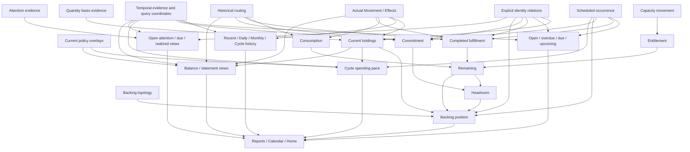

# LOAM household evidence graph

Status: cross-capability compression map before new practical implementation

This document looks across the household capabilities already exercised by HRA and h-kernel and asks a different question from the capability inventory:

> Which retained evidence is reused by many household answers, which answers are only projections, and where are several familiar domain objects preserving the same information shape?

This is an analysis map, not a proposal for a universal `Fact`, relation graph, object hierarchy, or new Practical Core schema.

## Comparison baseline

The map was refreshed against these repository heads:

```text
LOAM main      15fadb86f6c02200c717478dc9711ce85e2e57fc
HRA main       009d0442aca98dc669574ac19b289a37ce756fe2
h-kernel main  722b8460b056bf2d68d1cc837de403ee59f29c0c
```

At this point HRA and h-kernel already exercise the practical pressure that matters here:

- Actual recording and reversal;
- Plan creation, edit, completion, continuation / next occurrence;
- Envelope Entitlement, Consumption, Fulfillment, Remaining, Commitment, Headroom, and Backing;
- Issue lifecycle and Issue-to-Actual realization;
- historical and current time-sensitive observation;
- daily, monthly, cycle, statement, planned-payment, issue, and household-health views;
- interactive Home / Actual / Plan / Issue / Entitlement / Account / Report surfaces.

h-kernel's current Envelope ownership graph is especially useful reality pressure:

```text
Entitlement history
    -> Entitlement

Actual + historical Expense routing
    -> Consumption

Plan + completion evidence + Fulfillment routing
    -> Fulfillment

Entitlement - Consumption - Fulfillment
    -> Remaining

open Plan + routing
    -> Commitment

Remaining - Commitment
    -> Headroom

Asset holdings + funding obligations + Backing topology
+ Remaining + Headroom
    -> Backing
```

The important lesson is already visible there: most named Envelope values are observations, not separately written facts.

## First whole-household picture

A useful cross-capability decomposition currently looks like four semantic planes plus several cross-cutting evidence families.

```text
ACTUAL
  what changed

SCHEDULED
  what is expected to change

CAPACITY
  what may be allocated or spent for a purpose

ATTENTION
  what the household needs to keep in view even when no financial fact exists yet
```

These names describe meaning, not candidate Core constructors.

The cross-cutting families are:

```text
IDENTITY / RELATION
  correction, realization, successor, continuation, grouping

ROUTING / INTERPRETATION
  which purpose or role a stable subject has for one question

TIME
  valid day, learned time, effective-from, known-through, focus / interval

POLICY
  current presentation and query authority that must not rewrite historical meaning

BACKING TOPOLOGY
  which real holdings support which capacity pools
```

A compact system may reuse implementation shapes across these planes, but equal data shape does not imply equal semantic authority.

## Evidence graph



The graph is intentionally asymmetric. For example, Backing depends on capacity observations, but Backing does not authorize or create Entitlement. Likewise a report consumes observations and should not become a new owner of household truth.

## Retained evidence candidates

| Evidence family | Why some information appears independently observable | Current status | Compression pressure |
|---|---|---|---|
| Actual Movement / Effects | changes in quantity must survive independently of later interpretation | practical | already compact; keep one recording entrance |
| Event correction / effective relation | append-only correction changes the effective reading without rewriting the original | practical | do not replace relation provenance with mutable status |
| Quantity basis / basis correction / cut | an observed starting quantity is not itself a change; cut prevents double counting | practical | keep basis separate from Movement unless a stronger law appears |
| Scheduled occurrence | expected Effects and their scheduled coordinate are not Actual facts | shadow only; lifecycle under current Observation 105 pressure | test practical ownership only after whole-household compression |
| Capacity movement | HRA/h-kernel Entitlement is explicit normative movement, not an accounting balance | absent | strongest candidate for reusing Movement algebra on an explicitly distinct semantic plane |
| Attention evidence | Issue can exist before any Actual or Scheduled financial fact | absent | largest unobserved semantic plane in LOAM |
| Explicit relation provenance | realization, correction, successor, Series membership, and similar answers cannot generally be reconstructed from endpoint content | partly practical / heavily observed | same relation shape may be reusable, but semantic relations must not be collapsed merely to reduce type count |
| Historical routing | Consumption, Fulfillment, and Commitment depend on historical purpose assignment that current configuration must not rewrite | absent | major cross-capability compression seam |
| Temporal evidence | historical answers need valid / learned distinctions; coarse time and origin scope have already been observed separately in LOAM | extensively observed | reuse existing time results instead of starting a new generic Date model |
| Current query / presentation policy | cycle focus, selected Plans, eligible holdings, statement roles, visibility, ordering | partial | keep replaceable policy outside historical authority whenever possible |
| Backing topology | funding pools answer a question orthogonal to capacity | absent | probably a small overlay, not an Account/Envelope object graph |
| Series membership / recurrence rule | recurring-thread identity is not reconstructible from recurrence fields alone | observed, not practical | defer generation until scheduled lifecycle survives dogfood |
| Accounting / statement role | role is not intrinsic to neutral Locus | observed overlay, not practical | prefer question-scoped roles over universal Account identity |

## Capability to evidence matrix

`X` means the capability currently appears to require or directly observe that evidence family. `?` marks a compression question rather than an established dependency.

| Household answer | Actual | Scheduled | Capacity | Attention | Explicit relation | Routing / role | Time | Policy | Backing topology |
|---|:---:|:---:|:---:|:---:|:---:|:---:|:---:|:---:|:---:|
| Current holdings | X | | | | X | | ? | X | |
| Recent / Daily / Monthly / Cycle history | X | | | | X | | X | X | |
| Planned payments / calendar | | X | | | X | | X | X | |
| Envelope Consumption | X | | | | X | X | X | | |
| Envelope Fulfillment | X | X | | | X | X | X | | |
| Envelope Commitment | | X | | | X | X | X | | |
| Entitlement | | | X | | X | | X | | |
| Remaining / Headroom | X | X | X | | X | X | X | | |
| Backing | X | X | X | | X | X | X | X | X |
| Cycle spending pace | X | X | | | X | ? | X | X | ? |
| Open Issues / attention | | ? | | X | X | ? | X | X | |
| Balance Sheet / P&L | X | | | | X | X | X | X | |
| Home | projection of existing answers only | | | | | | | | |
| TUI / mouse / completion | presentation only | | | | | | | | |

This matrix exposes the high-degree seams. The most reusable evidence is not a `Report`, `Plan`, `Envelope`, or `Account` object. It is relation provenance, routing, temporal coordinates, and a few meaning-distinct quantity-bearing planes.

## What already looks safely derivable

The whole-household view strengthens several earlier local observations.

### Report names do not imply report facts

The following should remain projections unless a future operation proves otherwise:

```text
Daily / Monthly / Cycle / Recent
Balance Sheet / P&L
Planned Payments
Open Issues
Envelope Budget
Household Health
Home
```

They select, combine, classify, and render evidence. They do not currently justify their own canonical stored state.

### Envelope observations should not be duplicated

Current HRA/h-kernel reality pressure supports this shape:

```text
Capacity movement
    -> Entitlement

Actual + routing
    -> Consumption

Scheduled + realization + routing
    -> Fulfillment

open Scheduled + routing
    -> Commitment

Entitlement - Consumption - Fulfillment
    -> Remaining

Remaining - Commitment
    -> Headroom
```

The next LOAM work should try to preserve this one-owner property rather than recreating `spent`, `committed`, or `remaining` facts.

### User-facing operation names may be projections

Several verbs appear derivable from endpoint shape or time direction:

```text
capacity boundary -> purpose      = grant
purpose -> purpose                = reallocation
purpose -> capacity boundary      = release

scheduled -> later scheduled day  = postpone
scheduled -> earlier scheduled day = advance
```

A UI can say these words without requiring a stored operation-kind enum.

## Strong compression candidates

The global map changes the next research order. Scheduled lifecycle is useful, but it is not the only seam and should not be implemented in isolation yet.

### Candidate 1: reuse signed Effect algebra across Actual and Capacity

HRA/h-kernel already record Entitlement as movement-shaped evidence:

```text
unallocated -> purpose
purpose -> purpose
purpose -> unallocated
```

LOAM should test two smaller candidates:

```text
A. separate Movement and CapacityMovement structures

B. one signed Effect vector representation
   + an explicit semantic plane / authority that prevents capacity from entering physical holdings
```

The important test is not whether both can be encoded by one struct. The test is whether removing the plane creates worlds with identical retained records but different correct holdings / entitlement / permission answers.

If an explicit plane is sufficient, LOAM may reuse the Event / Effect algebra and much of the interaction shape without claiming that capacity is money or an accounting balance.

### Candidate 2: compress Expense routing and Fulfillment routing

Current HRA/h-kernel keep two historical routing shapes because their subjects differ:

```text
Expense-like subject @ effective day -> Purpose / unmanaged
Scheduled identity   @ effective day -> Purpose / not-fulfillment
```

Three important observations consume them:

```text
Actual + route -> Consumption
completed Scheduled + route -> Fulfillment
open Scheduled + route -> Commitment
```

LOAM should ask whether one typed, time-indexed `subject -> purpose-or-none` relation can retain exactly the distinctions these three questions observe, while keeping subject kind explicit.

This could remove duplicated routing machinery without introducing a universal metadata framework.

### Candidate 3: derive Commitment from Scheduled evidence rather than storing commitment

Early LOAM observations established that commitment is not derivable from physical history alone, and that intentional history carries independent information.

The whole-household map now provides a more concrete candidate source of that intention:

```text
open Scheduled occurrence
+ historical purpose routing
```

The next question is therefore narrower than Observation 013:

> Once a scheduled expectation and its routing are retained, is any additional commitment fact still observable by the practical Envelope questions?

If Alloy finds no bounded counterexample under the admitted household questions, Commitment can remain a projection even though intention itself remains independent of Actual history.

### Candidate 4: test whether Issue can reuse lifecycle relation shape without becoming Scheduled

Issue is the largest practical HRA/h-kernel capability that LOAM has not yet structurally observed.

A useful first comparison is:

```text
Scheduled
  has expected Effects + scheduled day
  may realize as Movement
  may continue / be replaced / retire

Attention
  has attention content + due state
  may realize as Movement
  may continue / close
```

The lifecycle relation shape may be reusable, but the endpoint facts are not obviously the same. A generic optional-field `Thing` would be syntactic compression only if it preserves no new household law.

The experiment should therefore try to share relation shape while actively seeking a counterexample to collapsing Scheduled and Attention identity.

### Candidate 5: keep statement classification as overlays rather than grow Account

LOAM has already observed that Locus need not become a conventional Account primitive and that accounting role can remain a separate overlay.

Practical Balance Sheet / P&L pressure should now ask only which role history must be durable and which role sets may remain replaceable query policy.

Do not reopen the abstract `is Account primitive?` question. Use concrete statement answers and historical reclassification pressure.

## Cross-cutting results that should not be reopened casually

The global map also prevents repeated experiments.

### Time is already richer than one date

LOAM has already observed, among other things:

- explicit relation time;
- valid time distinct from learned time;
- sparse change-point temporal views;
- origin-relative temporal cuts;
- valid-time origin scope distinct from learned-time scope.

HRA/h-kernel add practical pressure that `Observed_Through` is not presentation focus and that historical routing has an effective coordinate.

The next practical work should reuse these distinctions rather than inventing one universal `date` field.

### Physical facts do not determine intention

Earlier commitment observations already rejected deriving normative commitment from physical placement/history alone.

That does not force a `Commitment` object. It means some intentional evidence must survive. Scheduled evidence plus routing is now the concrete candidate to test.

### Locus does not imply Account role

Existing Account / AccountingRole observations already reject deriving accounting meaning merely from the physical Locus coordinate.

Practical statements should therefore pressure overlays, not pull Account into the neutral physical Core by default.

### Same relation shape is not automatically one semantic fact family

Correction, realization, successor, Series membership, routing, refund provenance, policy attribution, and Issue realization may all look relational.

LOAM has repeatedly found that later questions observe different provenance and cardinality. Reusing a helper representation is not evidence for one universal canonical relation stream.

## Candidate compact household vocabulary

The survey currently points toward the following research vocabulary:

```text
quantity-bearing evidence
  Actual
  Scheduled
  Capacity

non-quantity attention evidence
  Attention

cross-cutting evidence
  stable identity
  explicit semantic relations
  historical routing
  temporal coordinates
  replaceable current policy
  backing topology
```

Everything below should be treated as a projection until a counterexample says otherwise:

```text
balance
history windows
overdue / upcoming
consumption
fulfillment
commitment
remaining
headroom
backing position
spending pace
statement sections
calendar
home
```

This is deliberately not a proposed sum type. The goal is to identify the minimum independently observable information before choosing Lean ownership and persistence shapes.

## What the global survey changes

Before this map, a plausible sequence was:

```text
Scheduled lifecycle
-> implement it
-> Envelope
-> Issue
-> Reports
```

The whole-household dependency graph suggests a better sequence:

```text
1. finish / retain Scheduled lifecycle observation as one evidence piece
2. do not implement it yet
3. test Actual-vs-Capacity shape reuse
4. test the shared routing seam
5. test Scheduled + routing -> Commitment sufficiency
6. observe Attention / Issue against the lifecycle shape
7. only then choose the smallest practical canonical vocabulary
8. build Lean practical operations from that vocabulary
9. compose reports and TUI from the resulting observations
```

This sequence searches for compression across domain boundaries before those boundaries harden into production packages and persistence formats.

## Next executable observation

The cleanest next Alloy question exposed by the graph is:

> Can Actual value movement and Envelope-capacity movement reuse one signed Effect representation if and only if their semantic plane remains explicit?

The expected pressure is intentionally two-sided:

```text
erase the plane
    -> physical holdings and capacity answers can collide

retain the plane
    -> the same Effect algebra may serve both without semantic collision
```

If that boundary survives bounded search, it gives LOAM a concrete way to become smaller without pretending that money holdings and spending authority are the same thing.
