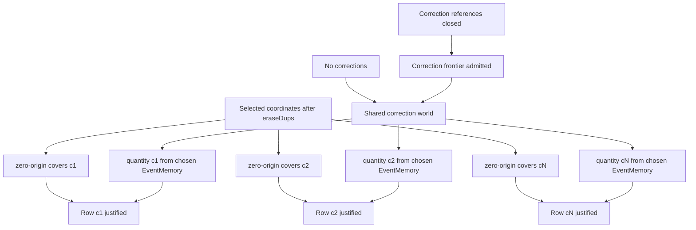

# Balance Review obligation DAG — G2-002 / G2-003

Status: **Generation-2 audit evidence, production simplification qualified**

This document decomposes the production `BalanceReview.project` claim into the
smallest obligations exposed by the DRAKONview pass. It is an audit instrument,
not a second runtime model.

## Root claim

For each selected presentation coordinate `c`, `BalanceReview` may return a row
only when:

1. `c` has independent zero-origin coverage;
2. the shared Event/correction world admits one quantity basis;
3. the quantity for `c` is projected from that admitted basis.

The important asymmetry is that (1) and (3) are coordinate-local, while (2)
depends only on the shared `EventMemory` and `EventCorrectionMemory`.

## Obligation DAG



The two routes into `Shared correction world` are semantic alternatives:

- with no correction facts, the original `EventMemory` is the quantity basis;
- with correction facts, endpoint closure and one admitted correction frontier
  are required before the frontier `EventMemory` becomes the quantity basis.

## G2-002 control-flow realization

At the G2-002 baseline production reached that DAG through this row-local shape:

```text
for each coordinate c
    zero-origin(c)?
    inspectQuantity(events, corrections, c)
        no corrections -> recorded quantity(c)
        otherwise:
            referencesClosed(events, corrections)?
            correctionFrontierMemory?(events, corrections)?
            frontier quantity(c)
```

Therefore every covered row re-evaluated the same correction-world obligation.
The coordinate changed, but the inputs to closure/frontier admission did not.

That was the G2-002 structural pressure:

```text
row A -> correction world A
row B -> correction world B
row C -> correction world C

where

correction world A
= correction world B
= correction world C
```

while the obligation DAG is:

```text
                one correction world
                /        |        \
             row A     row B     row C
```

## Refusal-order constraint

The repeated work could not simply be hoisted eagerly to the top of
`BalanceReview.project` without changing observable refusal ordering.

For example:

```text
coordinate A: uncovered
coordinate B: covered
corrections: invalid
```

must return the zero-origin error for A before correction topology is inspected.
Conversely:

```text
coordinate A: covered
coordinate B: uncovered
corrections: invalid
```

must expose the correction error while processing A before B is reached.

So the DAG licensed sharing of the correction-world obligation, but did not
license arbitrary reordering of coordinate-local gates.

## G2-003 qualification

The key simplification is stronger than the original lazy-cache sketch.

An uncovered coordinate terminates the whole Balance Review immediately. As a
result, a non-empty projection can only reach any later row if the **first**
coordinate is covered. This means no Option cache or thunk needs to be threaded
through recursion.

The qualified control flow is:

```text
eraseDups coordinates

empty?
    yes -> return empty Snapshot

first coordinate covered?
    no  -> return first zero-origin diagnostic
    yes -> resolve quantity basis ONCE

quantity basis admitted?
    no  -> return correction diagnostic
    yes -> project first row

for each remaining coordinate left-to-right
    covered?
        no  -> return that zero-origin diagnostic
        yes -> project quantity from SAME basis

return Snapshot
```

This preserves every relevant refusal boundary:

- empty selection still does not force correction admission;
- an uncovered first row still wins over malformed correction evidence;
- once the first row is covered, correction admission still precedes every later
  row gate, exactly as in the former row-local implementation;
- later uncovered rows remain left-to-right failures after one admitted basis.

The production change stays local to `BalanceReview`. It introduces no public
Evidence object, no inspection context, and no second quantity arithmetic engine.
The existing `correctionReferencesClosed`, `correctionFrontierMemory?`, and
`EventMemory.quantityAtRecorded` primitives remain the semantic owners.

## Qualification cases

`Loam/Tests/BalanceReview.lean` now pins these cases:

```text
1. valid correction + multiple covered coordinates
   -> one shared frontier basis produces both rows

2. empty selection + broken correction endpoint
   -> success with empty Snapshot; unused correction obligation stays lazy

3. [uncovered, covered] + broken correction endpoint
   -> zero-origin diagnostic for the first coordinate

4. [covered, uncovered] + broken correction endpoint
   -> correction-reference diagnostic before the later coverage failure
```

These are the observable cases that distinguish a safe shared basis from an
unsafe eager hoist.

## Verdict

**G2-003: SIMPLIFY QUALIFIED.**

DRAKONview exposed query-global correction work inside a row-local loop. The DAG
showed one shared correction-world node and, crucially, the refusal-order edge
that constrained the refactor. Production can now resolve that node once per
non-empty admitted Balance Review and fan the resulting Event basis out to all
rows without adding a new public abstraction.
