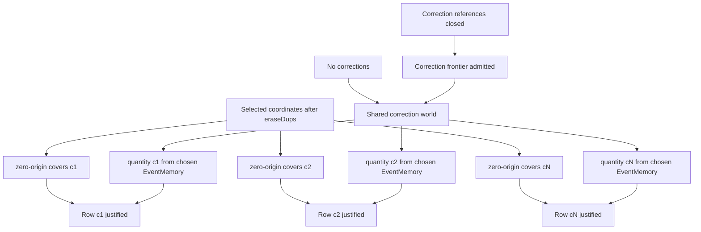

# Balance Review obligation DAG — G2-002

Status: **Generation-2 audit evidence**

This document decomposes the production `BalanceReview.project` claim into the
smallest obligations exposed by the DRAKONview pass. It is an audit instrument,
not a second runtime model.

## Root claim

For each selected presentation coordinate `c`, `BalanceReview` may return a row
only when:

1. `c` has independent zero-origin coverage;
2. the shared Event/correction world admits one quantity basis;
3. the quantity for `c` is projected from that admitted basis.

The important asymmetry is that (1) and (3) are coordinate-local, while (2)
depends only on the shared `EventMemory` and `EventCorrectionMemory`.

## Obligation DAG



The two routes into `Shared correction world` are semantic alternatives:

- with no correction facts, the original `EventMemory` is the quantity basis;
- with correction facts, endpoint closure and one admitted correction frontier
  are required before the frontier `EventMemory` becomes the quantity basis.

## Current control-flow realization

Production currently reaches that DAG through this row-local shape:

```text
for each coordinate c
    zero-origin(c)?
    inspectQuantity(events, corrections, c)
        no corrections -> recorded quantity(c)
        otherwise:
            referencesClosed(events, corrections)?
            correctionFrontierMemory?(events, corrections)?
            frontier quantity(c)
```

Therefore every covered row re-evaluates the same correction-world obligation.
The coordinate changes, but the inputs to closure/frontier admission do not.

That is the G2-002 structural pressure:

```text
current control flow

row A -> correction world A
row B -> correction world B
row C -> correction world C

where

correction world A
= correction world B
= correction world C
```

while the obligation DAG is:

```text
                one correction world
                /        |        \
             row A     row B     row C
```

## Refusal-order constraint

The repeated work cannot simply be hoisted eagerly to the top of
`BalanceReview.project` without changing observable refusal ordering.

Today coordinates are inspected left-to-right. For example:

```text
coordinate A: uncovered
coordinate B: covered
corrections: invalid
```

returns the zero-origin error for A before correction topology is inspected.
Conversely:

```text
coordinate A: covered
coordinate B: uncovered
corrections: invalid
```

may return the correction error while processing A before B is reached.

So the DAG licenses sharing of the correction-world obligation, but it does not
license arbitrary reordering of the coordinate-local gates.

The smallest behavior-preserving candidate is therefore **lazy sharing**:
resolve the correction quantity basis on the first covered row that needs it,
then reuse that already-resolved basis for later covered rows. Earlier uncovered
rows still fail before the shared obligation is forced.

## Verdict

**SIMPLIFY CANDIDATE CONFIRMED; production change deferred to qualification.**

DRAKONview exposed repeated query-global work inside a row-local loop. The DAG
shows that one correction-world node is sufficient for all rows. The remaining
obligation before changing production is behavioral equivalence around refusal
ordering and diagnostics.

A follow-up implementation should stay local to the Balance Review boundary
unless a second production consumer independently exhibits the same prepared
quantity-basis need. Do not create a general public Evidence or inspection
context merely to satisfy this one observation.
