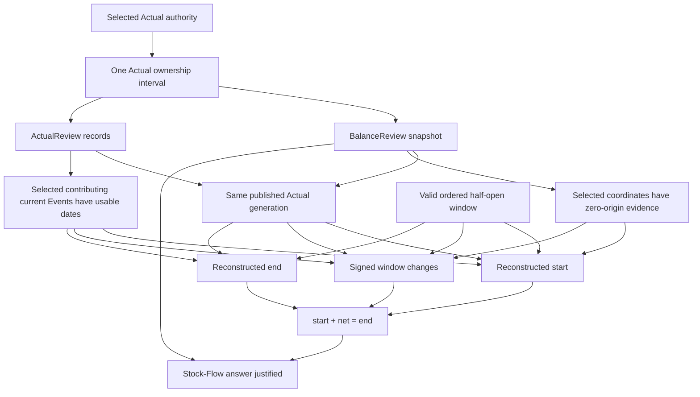

# Flow Review obligation DAG — G2-004

Status: **Generation-2 audit evidence**

Primary instruments: **DRAKONview + proof-obligation DAG**.

This audit places `StockFlowReview` and `TransactionsFlowReview` beside each other
at the same semantic scale. The goal is not to merge two reports that happen to
use dates and half-open windows. It is to identify which obligations are truly
shared, which are report-local, and whether either path observes the same
canonical authority more than once without a same-generation guarantee.

## Sibling topology

Both reports consume correction-aware `ActualReview.Record` values and validate
one explicit half-open date window.

They then diverge:

- Transactions Flow represents Event/coordinate incidence. Every current
  quantity-bearing Event may become a column.
- Stock Flow relates selected current balances to historical boundaries over the
  same selected coordinates. It therefore composes `BalanceReview` and
  `ActualReview`.

At the G2-004 baseline, `TransactionsFlowReview.loadSnapshot` performed one
Actual-backed read. `StockFlowReview.loadSnapshot` performed two:

```text
BalanceReview.loadSnapshot
    -> Actual authority read A

ActualReview.loadRecordsFromActual
    -> Actual authority read B
```

Without one ownership interval, an atomic writer may publish a new
`actual.loam` generation between A and B. Each read is individually valid, but
the composed Stock-Flow answer can then join balances from one generation with
records from another.

## Root Stock-Flow claim

A Stock-Flow answer is justified only when:

1. the selected balance coordinates have admitted zero-origin evidence;
2. balances and Actual records observe the same published Actual generation;
3. every current Event contributing nonzero quantity to a selected coordinate
   has a usable occurrence date;
4. the requested endpoints are valid and ordered;
5. reconstructed boundary arithmetic satisfies `start + net = end`.

The obligation DAG is:



The important new node is `Same published Actual generation`. It is not implied
merely because both readers use the same canonical file path. It requires one
observation interval that prevents publication from switching generations
between the two decodes.

## Qualified repair

The production repair is deliberately smaller than a new shared Evidence API.
`StockFlowReview.loadSnapshot` now enters
`ActualAuthority.withActualFileOwnership` around the existing Balance Review and
Actual Review loads.

```text
lock selected actual.loam
    BalanceReview.loadSnapshot
    ActualReview.loadRecordsFromActual
unlock
StockFlowReview.project
```

The two readers remain semantic owners of their decoding and admission rules.
No second Event decoder, report authority, or cross-report evidence structure is
introduced.

This matches the already-qualified Cycle Budget pattern: repeated reads are
allowed when they are useful composition boundaries, but a composed answer must
not cross an Actual publication boundary when it claims one coherent Actual
world.

## Why the date validators stay separate

The sibling paths look similar enough to tempt a generic date/window helper, but
their proof domains differ.

### Stock Flow

A current Event requires a date only when its net contribution to the selected
balance coordinates is nonzero.

```text
current?
  no -> ignore
selected-coordinate net quantity != 0?
  no -> ignore
date usable?
  no -> refuse Stock-Flow
```

An Event outside the selected balance coordinates does not affect Stock-Flow
boundary reconstruction and therefore does not need to be positioned.

### Transactions Flow

A current Event requires a date whenever it is quantity-bearing at all, because
any such Event may become an incidence column.

```text
current and effects nonempty?
  no -> ignore
date usable?
  no -> refuse Transactions-Flow
```

This broader admissibility domain is not presentation policy. It follows from
the represented relation itself.

A generic validator would therefore need a policy callback or report mode large
enough to recreate the distinction it was supposed to remove.

Verdict: **KEEP separate date validators and window projectors**.

## G2-004 verdict

Two results are recorded:

- **REPAIR QUALIFIED IN STRUCTURE**: Stock Flow's two Actual-backed reads belong
  inside one short Actual ownership interval. The production change uses the
  existing ownership primitive and no new semantic API.
- **KEEP**: Stock Flow and Transactions Flow retain separate date admissibility
  and projection logic because their represented domains differ.

CI qualification should confirm the repaired Stock-Flow boundary and downstream
report/TUI surfaces before merge.
