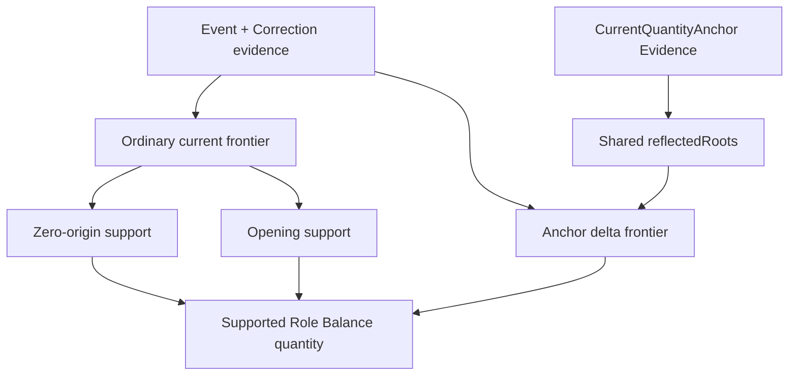
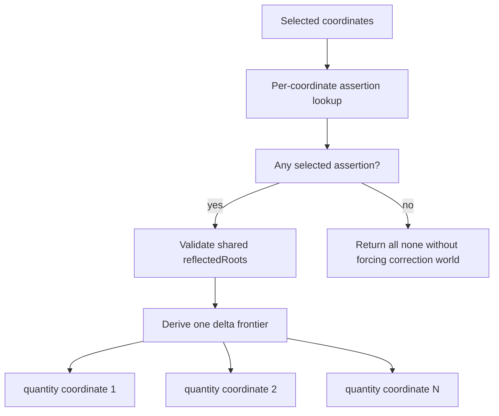

# Quantity-world sharing obligation DAG — G2-006

Status: **Generation-2 audit evidence**

Primary instruments: **DRAKONview + proof-obligation DAG**.

G2-005 exposed a second layer underneath Role Balance support routing. Routing is
now evaluated once per candidate, but the supported leaves do not all consume the
same quantity world. G2-006 asks which world can be shared, which boundary should
remain independent, and where sharing would erase an earned semantic distinction.

## Root claim

A Role Balance quantity is justified only through its admitted support family and
the quantity world owned by that family.

There are two different worlds:

1. **ordinary current correction frontier**
   - used by zero-origin and opening support;
   - contains every current terminal Event after ordinary correction admission;
2. **current-anchor delta frontier**
   - starts from one asserted reconciliation image;
   - excludes stable correction roots already reflected by that observation;
   - adds only the current terminals outside the reflected-root cut.

They are deliberately not interchangeable.



The convergence at `Q` means the results share one report surface. It does **not**
mean the upstream quantity worlds should be collapsed.

## Why the worlds stay separate

The ordinary frontier answers:

> What quantity is present in the current correction-aware Event world?

The anchor frontier answers:

> Starting from a quantity already observed at one reconciliation boundary, what
> additional current quantity comes from stable roots that observation did not
> already reflect?

If the ordinary frontier were substituted for the anchor delta frontier, covered
roots would be counted again. If the anchor cut were imposed on zero-origin or
opening support, those support families would silently inherit observation state
they do not own.

Verdict: **KEEP TWO WORLDS**.

## Ordinary-world sharing

`RoleBalanceReview.project` must admit one ordinary correction frontier before it
can validate opening witnesses or enumerate current-frontier coordinates. G2-005
showed that later supported leaves were nevertheless re-entering correction
inspection.

### Opening support

Opening support is owned directly by Role Balance. Once the root frontier has
been admitted and the retained opening Event witness has been validated, each
opening-supported coordinate needs only:

```text
ordinary frontier
    + coordinate
    -> EventMemory.quantityAtRecorded
```

G2-006 therefore reuses the already-admitted frontier for all opening rows.
There is no new arithmetic engine and no new evidence type.

Verdict: **SIMPLIFY**.

### Zero-origin support

Zero-origin rows are different. `BalanceReview` is the established semantic owner
of zero-origin projection and its refusal ordering. Passing a bare `EventMemory`
frontier into a new bypass API would either:

- weaken provenance by letting callers supply an arbitrary EventMemory as an
  "admitted basis"; or
- require a new proof-carrying/prepared basis type whose only current purpose is
  to avoid one already-bounded re-admission.

G2-006 therefore keeps:

```text
RoleBalance ordinary frontier
        |
        +--> opening rows reuse it
        |
        +--> zero-origin bucket
                -> BalanceReview.project
                -> BalanceReview admits its own basis
```

The second admission is computationally redundant but semantically local to the
existing owner. Removing it currently costs more concept surface than it saves.

Verdict: **KEEP BOUNDARY RE-ADMISSION**.

Revisit only if another production caller independently earns an admitted
BalanceReview-basis API with real provenance, not merely an untyped EventMemory.

## Anchor-world sharing

`CurrentQuantityAnchor.Evidence` explicitly represents one reconciliation image:

- one shared `reflectedRoots` list;
- several coordinate-local asserted quantities.

Before G2-006, Role Balance called `inspectQuantity` once per anchor coordinate.
Each call repeated the same correction-closure check, stable-root validation and
delta-frontier derivation even though none of those obligations depends on the
coordinate.

The DAG factorization is:



`CurrentQuantityAnchor.inspectQuantities` now implements this shape. It introduces
no prepared-basis type. The existing point API and the bulk API share one private
`deltaFrontier` admission helper and one `quantityFromDelta` projection helper.

Role Balance uses the bulk API for its entire current-anchor bucket, so one
reconciliation image now derives one delta frontier per projection rather than
one per coordinate.

Verdict: **SIMPLIFY**.

## Qualification obligations

The production change must preserve all of these:

- point inspection still returns `none` without forcing correction admission when
  the requested coordinate has no assertion;
- unknown reflected roots still fail closed;
- a corrected reflected root remains absorbed by the observation;
- an unreflected later root remains a delta;
- several asserted coordinates projected together equal their pointwise meanings;
- Role Balance still refuses overlapping zero-origin/opening/anchor support;
- zero-origin results remain equal to neighboring `BalanceReview` results;
- opening support does not leak into `BalanceReview`.

The dedicated Current Quantity Anchor and Role Balance tests are the primary
runtime qualification surface.

## Generation-2 verdict

**PARTIAL SIMPLIFY + KEEP**.

G2-006 does not reward the shortest call graph. It rewards the smallest justified
semantic graph:

```text
ordinary frontier
  opening     -> share
  zero-origin -> keep owner boundary

anchor reconciliation image
  selected assertions -> share one cut world

ordinary world != anchor world
```

This is the intended Generation-2 behavior: DRAKONview reveals duplicated shape,
the DAG says which nodes are genuinely identical, and production sharing stops
exactly where semantic ownership changes.
