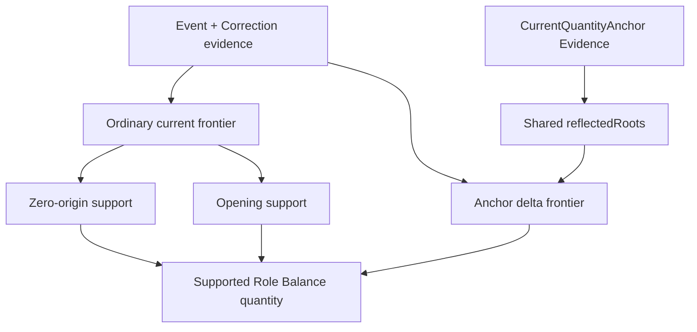
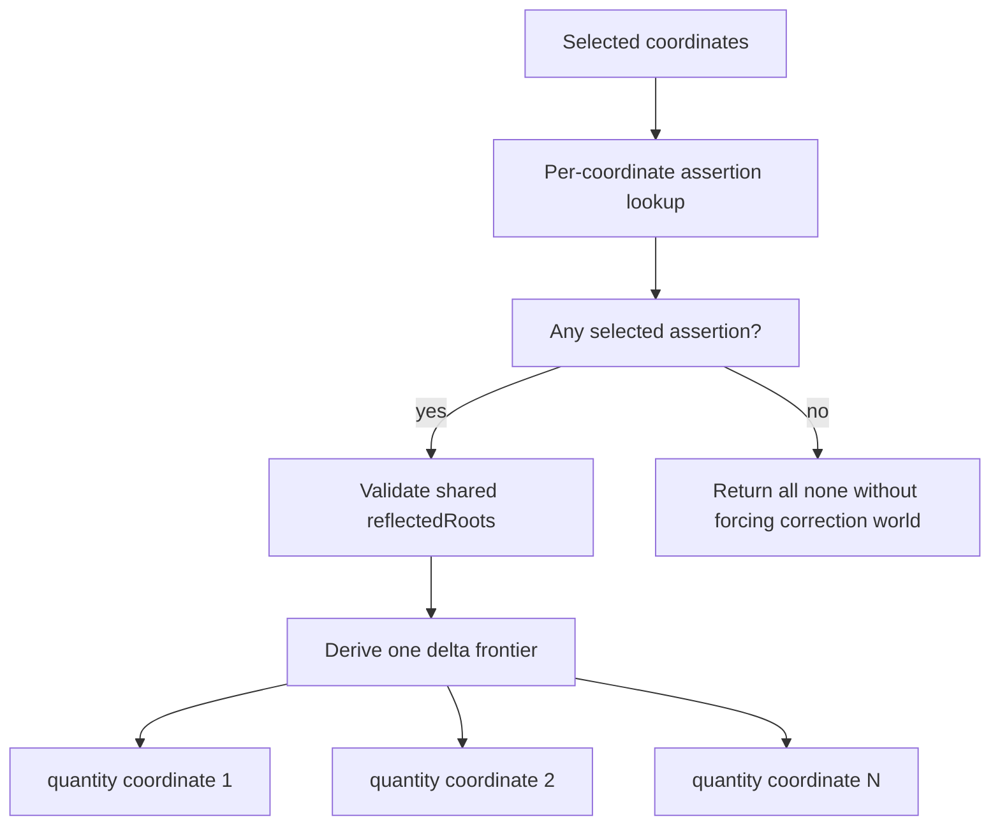

# Quantity-world sharing obligation DAG — G2-006

Status: **CURRENT PRODUCTION BOUNDARY / Generation-2 audit evidence**

Primary instruments: **DRAKONview + proof-obligation DAG**.

G2-005 exposed a second layer underneath Role Balance support routing. Routing is
now evaluated once per candidate, but the supported leaves do not all consume the
same quantity world. G2-006 asks which world can be shared, which boundary should
remain independent, and where sharing would erase an earned semantic distinction.

## Root claim

A Role Balance quantity is justified only through its admitted support family and
the quantity world owned by that family.

There are two different worlds:

1. **ordinary current correction frontier**
   - used by zero-origin and opening support;
   - contains every current terminal Event after ordinary correction admission;
2. **current-anchor delta frontier**
   - starts from one asserted reconciliation image;
   - excludes stable correction roots already reflected by that observation;
   - adds only the current terminals outside the reflected-root cut.

They are deliberately not interchangeable.


```mermaid
flowchart TD
    E[Event + Correction evidence]
    O[Ordinary current frontier]
    Z[Zero-origin support]
    P[Opening support]
    A[CurrentQuantityAnchor Evidence]
    R[Shared reflectedRoots]
    D[Anchor delta frontier]
    Q[Supported Role Balance quantity]

    E --> O
    O --> Z
    O --> P
    A --> R
    E --> D
    R --> D
    Z --> Q
    P --> Q
    D --> Q
```

The convergence at `Q` means the results share one report surface. It does **not**
mean the upstream quantity worlds should be collapsed.

## Why the worlds stay separate

The ordinary frontier answers:

> What quantity is present in the current correction-aware Event world?

The anchor frontier answers:

> Starting from a quantity already observed at one reconciliation boundary, what
> additional current quantity comes from stable roots that observation did not
> already reflect?

If the ordinary frontier were substituted for the anchor delta frontier, covered
roots would be counted again. If the anchor cut were imposed on zero-origin or
opening support, those support families would silently inherit observation state
they do not own.

Verdict: **KEEP TWO WORLDS**.

## Ordinary-world sharing

`RoleBalanceReview.project` must admit one ordinary correction frontier before it
can validate opening witnesses or enumerate current-frontier coordinates. G2-005
showed that later supported leaves were nevertheless re-entering correction
inspection.

### Opening support

Opening support is owned directly by Role Balance. Once the root frontier has
been admitted and the retained opening Event witness has been validated, each
opening-supported coordinate needs only:

```text
ordinary frontier
    + coordinate
    -> EventMemory.quantityAtRecorded
```

G2-006 therefore reuses the already-admitted frontier for all opening rows.
There is no new arithmetic engine and no new evidence type.

Verdict: **SIMPLIFY**.

### Zero-origin support

Zero-origin rows are different. `BalanceReview` is the established semantic owner
of zero-origin projection and its refusal ordering. Passing a bare `EventMemory`
frontier into a new bypass API would either:

- weaken provenance by letting callers supply an arbitrary EventMemory as an
  "admitted basis"; or
- require a new proof-carrying/prepared basis type whose only current purpose is
  to avoid one already-bounded re-admission.

G2-006 therefore keeps:

```text
RoleBalance ordinary frontier
        |
        +--> opening rows reuse it
        |
        +--> zero-origin bucket
                -> BalanceReview.project
                -> BalanceReview admits its own basis
```

The second admission is computationally redundant but semantically local to the
existing owner. Removing it currently costs more concept surface than it saves.

Verdict: **KEEP BOUNDARY RE-ADMISSION**.

Revisit only if another production caller independently earns an admitted
BalanceReview-basis API with real provenance, not merely an untyped EventMemory.

## Stage B-4 follow-up: admitted provenance now exists

The G2-006 decision to keep zero-origin boundary re-admission was correct for its
time: the only shareable ordinary basis was a bare `EventMemory`, and exposing
that as "already admitted" would have weakened provenance.

Stage A later introduced `ActualAuthority.Image`. Its `currentEvents` field is
proof-carrying: the image stores the theorem that the retained Events and
Corrections admit exactly that current frontier.

Stage B-4 can therefore remove the canonical RoleBalance -> BalanceReview
re-admission without inventing the broad prepared-basis type G2-006 rejected:

```text
canonical ActualAuthority.Image
        |
        +--> image.currentEvents
        |       +--> RoleBalance opening rows
        |       +--> BalanceReview.projectImage zero-origin rows
        |
        +--> image.evidence.events + corrections
                -> CurrentQuantityAnchor delta frontier
```

The raw/in-memory `RoleBalanceReview.project` and `BalanceReview.project`
entrances still self-admit. Thus the historical **KEEP BOUNDARY RE-ADMISSION**
verdict remains true for arbitrary raw evidence, while the canonical
proof-carrying path is now **SIMPLIFY**.

## Anchor-world sharing

`CurrentQuantityAnchor.Evidence` explicitly represents one reconciliation image:

- one shared `reflectedRoots` list;
- several coordinate-local asserted quantities.

Before G2-006, Role Balance called `inspectQuantity` once per anchor coordinate.
Each call repeated the same correction-closure check, stable-root validation and
delta-frontier derivation even though none of those obligations depends on the
coordinate.

The DAG factorization is:


```mermaid
flowchart TD
    C[Selected coordinates]
    S[Per-coordinate assertion lookup]
    N[Any selected assertion?]
    R[Validate shared reflectedRoots]
    D[Derive one delta frontier]
    Q1[quantity coordinate 1]
    Q2[quantity coordinate 2]
    QN[quantity coordinate N]

    C --> S
    S --> N
    N -->|no| X[Return all none without forcing correction world]
    N -->|yes| R
    R --> D
    D --> Q1
    D --> Q2
    D --> QN
```

`CurrentQuantityAnchor.inspectQuantities` now implements this shape. It introduces
no prepared-basis type. The existing point API and the bulk API share one private
`deltaFrontier` admission helper and one `quantityFromDelta` projection helper.

Role Balance uses the bulk API for its entire current-anchor bucket, so one
reconciliation image now derives one delta frontier per projection rather than
one per coordinate.

Verdict: **SIMPLIFY**.

## Durable quantity-support boundary from Observations 243/244/246/345/346

The detailed prose for Observations 243, 244, 246, 345, and 346 has graduated
to Git history. Their five Alloy models remain live independent witnesses.

The current production boundary preserves three distinct questions.

### Current quantity support is not origin completeness

Observation 243 established that an exact current/as-of quantity can be justified
without claiming exact history from zero.

Production therefore keeps these authorities separate:

- `ZeroOriginCoverage` for the strong zero-origin route;
- `OpeningSupport` for a narrow current opening witness;
- `CurrentQuantityAnchor` for independently observed current quantity;
- `BoundedHistorySupport` for an explicit complete-since historical interval.

A supported current quantity never implies zero-origin completeness.

### CurrentQuantityAnchor owns the observed-present cut

Observations 244 and 246 earned the minimum information required for a later
exact observation without resurrecting the retired QuantityBasis/BasisCut
subsystem.

Current production retains:

```text
anonymous reconciliation group
  shared reflected Event correction roots
  one or more exact Locus × Measure assertions
```

Every coordinate belongs to at most one current group. Re-observing a coordinate
may move only that coordinate into a new anonymous group while unrelated groups
remain intact.

The reflected-root cut is independent evidence. It is not inferred from date,
file order, Event order, or Git history. Corrections to reflected roots remain
absorbed by the observation; roots outside the cut remain deltas.

The group has no stable semantic identity, correction graph, or chronology.

### Bounded historical support owns explicit complete-since evidence

Observations 345 and 346 later earned a second, independently stated fact:

```text
coordinate + complete-since start day
```

Current production owners are:

- `Loam/BoundedHistorySupport.lean`;
- `Loam/Persistence/BoundedHistorySupportPersistence.lean`;
- `Loam/BoundedHistorySupportPublisher.lean`;
- `Loam/BoundedHistorySupportReview.lean`;
- `Loam/HistoricalBalanceReview.lean`;
- `Loam/Tui/BoundedHistorySupportAdministration.lean`.

The claim says that every real quantity change from the start of the stated day
onward is represented by dated, correction-aware Actual evidence for that
coordinate.

It does **not** store an opening quantity. Exact quantity at an earlier boundary
inside the supported interval is reconstructed backwards:

```text
exact current CurrentQuantityAnchor
-
current-truth dated Actual delta after requested boundary
=
historical quantity at requested boundary
```

The current Event world and dates come from one admitted `ActualAuthority.Image`.

A bounded claim is admitted only with a usable exact current anchor. A query
before the coordinate's start day fails closed. OpeningSupport alone does not
authorize historical reconstruction, and overlapping support families are
refused rather than assigned precedence.

### Reconciliation does not certify unknown earlier history

Numeric endpoint agreement never creates bounded-history evidence.

An unexplained correction/adjustment may establish a later observed quantity
boundary, but it does not retroactively prove the categories, causes, or detailed
completeness of an earlier interval. Production need not introduce an
`Adjustment` Core primitive for this result: unexplained exact movements remain
ordinary Actual evidence, with occurrence-date refinement owned separately by
ActualValidity.

The complete-since claim remains explicit household evidence that can be set,
moved, or removed through its publisher/TUI.

### Live bounded research retained

The following models remain active in Alloy CI:

- Observation 243 — current versus historical balance support;
- Observation 244 — temporal quantity-anchor compression;
- Observation 246 — shared current-anchor root cut;
- Observation 345 — reconciled interval boundary;
- Observation 346 — backward anchor reconstruction.

The working tree no longer needs their long historical prose beside current
production code and this durable boundary description.

### Durable non-goals

Do not use quantity-support compression to:

- weaken `ZeroOriginCoverage`;
- infer completeness from matching endpoints;
- treat missing support as numeric zero;
- reinterpret `OpeningSupport` as historical completeness;
- infer reflected roots from chronology;
- merge independent reconciliation groups;
- restore the retired generic QuantityBasis/BasisCut subsystem;
- persist derived opening quantities merely for historical reconstruction;
- invent hidden historical Events;
- make adjustment/reconciliation evidence certify prior detailed history.

## Qualification obligations

The production change must preserve all of these:

- point inspection still returns `none` without forcing correction admission when
  the requested coordinate has no assertion;
- unknown reflected roots still fail closed;
- a corrected reflected root remains absorbed by the observation;
- an unreflected later root remains a delta;
- several asserted coordinates projected together equal their pointwise meanings;
- Role Balance still refuses overlapping zero-origin/opening/anchor support;
- zero-origin results remain equal to neighboring `BalanceReview` results;
- opening support does not leak into `BalanceReview`.

The dedicated Current Quantity Anchor and Role Balance tests are the primary
runtime qualification surface.

## Generation-2 verdict

**PARTIAL SIMPLIFY + KEEP**.

G2-006 does not reward the shortest call graph. It rewards the smallest justified
semantic graph:

```text
ordinary frontier
  opening     -> share
  zero-origin -> keep owner boundary

anchor reconciliation image
  selected assertions -> share one cut world

ordinary world != anchor world
```

This is the intended Generation-2 behavior: DRAKONview reveals duplicated shape,
the DAG says which nodes are genuinely identical, and production sharing stops
exactly where semantic ownership changes.
