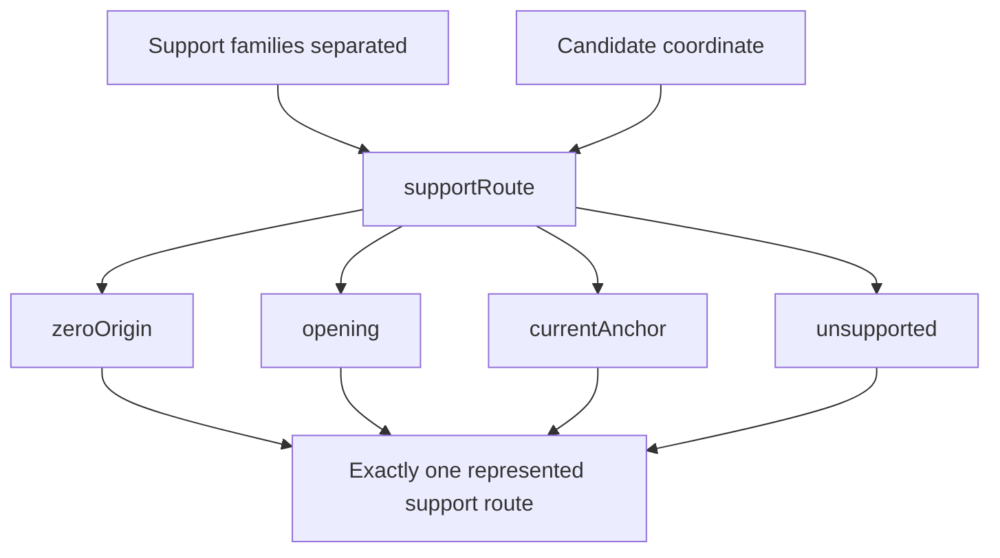
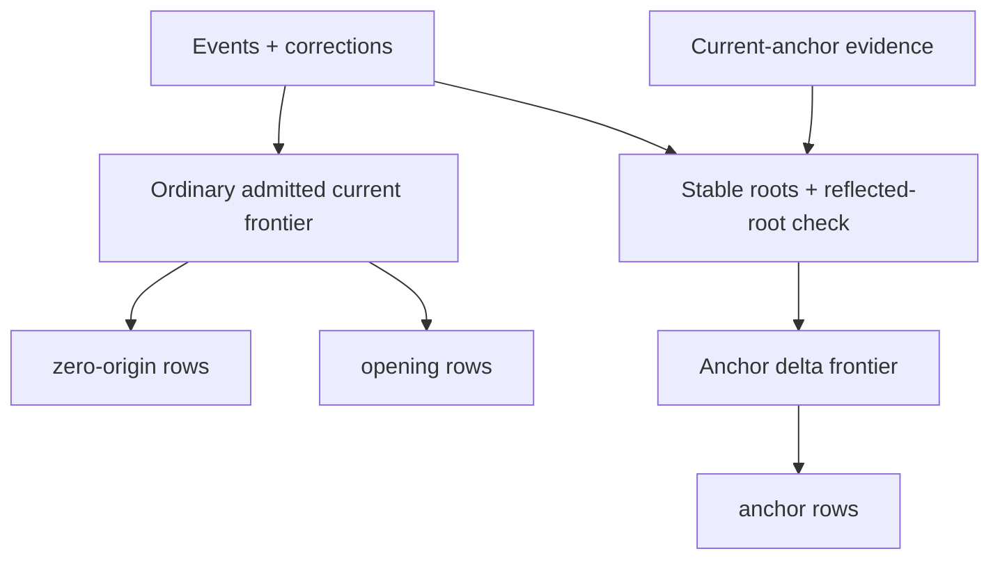

# Role Review obligation DAG — G2-005

Status: **Generation-2 audit evidence**

Primary instruments: **DRAKONview + production-bound proof-obligation DAG**.

This audit places `RoleFlowReview` and `RoleBalanceReview` beside each other at the same semantic scale. The important question is not whether both reports use `AccountingRole`. It is whether their upstream evidence, branch obligations, and quantity worlds are actually the same.

## Sibling topology

`RoleFlowReview` is deliberately thin:

```text
TransactionsFlowReview snapshot
        +
AccountingRole map
        |
        v
classified coordinate rows
+
unresolved Effect witnesses
```

It does not read Actual independently, rebuild the correction frontier, or own a second date/window engine. Missing role evidence remains visible as concrete selected Effects instead of being numerically cancelled away.

`RoleBalanceReview` has a different topology:

```text
BalanceReview evidence
opening support
current-anchor evidence
AccountingRole map
        |
        v
one admitted current correction frontier
        |
        v
validate opening witnesses
validate support-family separation
        |
        v
candidate coordinate universe
        |
        v
supportRoute
  /      |       |        \
 Z       O       A         U
zero   opening  anchor  unsupported
```

The richer partition is earned by current-balance support semantics. It is not a role-classification concern and should not be pushed into `RoleFlowReview`.

Verdict for the sibling boundary: **KEEP SEPARATE**.

## Existing production-bound DAG

`RoleBalanceReview.supportRoute` already owns the production decision:

- `zeroOrigin`
- `opening`
- `currentAnchor`
- `unsupported`

Four private leaf theorems prove the individual cases, and `support_partition_root` proves that every coordinate reaches one constructor of the same runtime function. No proof-only routing model exists.

The important precondition is `validateSupportSeparation`. Support families are deliberately non-overlapping. Therefore branch order inside `supportRoute` is not a precedence policy; overlap refuses before routing.

Conceptually:



## G2-005 runtime mismatch

Before G2-005, the proof DAG said "one production decision", but `project` materialized the four buckets with four separate filters:

```text
candidates.filter route == zeroOrigin
candidates.filter route == opening
candidates.filter route == currentAnchor
candidates.filter route == unsupported
```

For one coordinate the same pure `supportRoute` could therefore be evaluated up to four times. This did not change semantics, but it meant the runtime topology did not match the production-bound DAG.

DRAKONview made the mismatch visually obvious:

```text
proved shape
candidate -> route ONCE -> one of four leaves

runtime baseline
candidate -> route? Z
          -> route? O
          -> route? A
          -> route? U
```

## Qualified production shape

G2-005 introduces one private `SupportBuckets` value and one private `routeCandidates` traversal.

```text
candidate list
    |
    v
for each coordinate
    |
    v
supportRoute ONCE
    |
    +--> zeroOrigin bucket
    +--> opening bucket
    +--> currentAnchor bucket
    +--> unsupported bucket
```

The recursion preserves candidate order within each family. No public routing API, new semantic constructor, or second proof model is added. The existing leaf/root theorems continue to refer directly to the same `supportRoute` used by runtime.

Verdict: **SIMPLIFY**.

## Remaining quantity-basis pressure

The same DRAKON pass exposed a second layer, but G2-005 deliberately does not collapse it into the routing change.

At the top of `RoleBalanceReview.project`, one ordinary correction frontier is already admitted:

```text
frontier := correctionFrontierMemory?(events, corrections)
```

That frontier is then used for opening-support witness validation and candidate discovery. However downstream supported-row projection currently reaches correction semantics again:

```text
zero-origin bucket
    -> BalanceReview.project
       -> correction frontier admission again

opening bucket
    -> inspectQuantity per coordinate
       -> correction frontier admission again per coordinate
```

Current-anchor support is different. It has one shared `reflectedRoots` cut and derives a delta frontier that excludes complete roots already represented by the external current observation:

```text
current-anchor evidence
    |
    +--> stable correction roots
    +--> reflectedRoots subset check
    +--> correction frontier excluding reflected roots
             |
             +--> quantity(anchor coordinate A)
             +--> quantity(anchor coordinate B)
             +--> ...
```

`CurrentQuantityAnchor.inspectQuantity` presently reconstructs that same cut world for each anchored coordinate.

The obligation DAG therefore has **two distinct shareable worlds**, not one universal balance basis:



Merging `F` and `D` would be wrong. The current-anchor frontier intentionally excludes roots already reflected by the reconciliation observation, while ordinary zero-origin/opening quantities use the complete current correction frontier.

However, repeated reconstruction **within** each earned world is a legitimate next audit candidate:

- reuse the already-admitted ordinary frontier for zero-origin/opening rows without creating a second quantity engine;
- prepare the anchor cut world once per `CurrentQuantityAnchor.Evidence`, then project all anchor coordinates from that shared delta frontier.

Verdict at G2-005: **G2-006 CANDIDATE; DEFER PRODUCTION CHANGE**.

The deferral is intentional. The next step must preserve semantic ownership and diagnostics without inventing a broad `BalanceContext` abstraction simply because two repeated computations were found.
