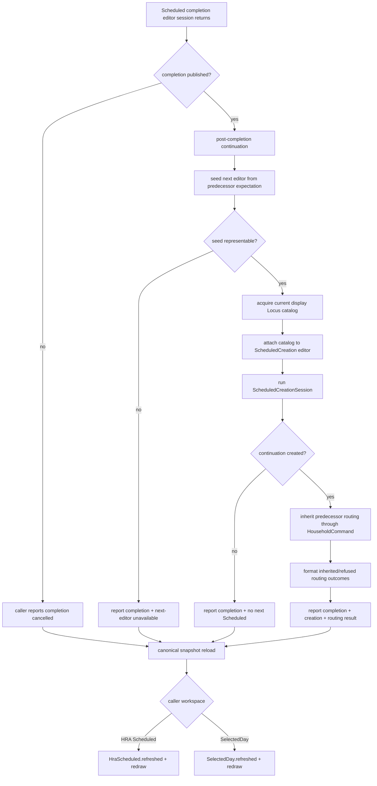

# MGA-016 — Scheduled continuation session obligation DAG

Status: **SPLIT_CANDIDATE — implementation experiment under qualification in PR #977**

Primary instruments: **DRAKONview + obligation DAG + source/history + production qualification**.

Baseline main:

```text
d75c4e19199297c2c3e983201a6f389d293b0135
refactor(tui): isolate Scheduled completion session (#974)
```

## Question

MGA-015 deliberately stopped `ScheduledCompletionSession` at one Boolean result. Completion
publication is now separate from the optional continuation interaction that follows it.

After that split, both HRA Scheduled and SelectedDay still contained the same post-completion
corridor:

```text
completion published
-> seed next Scheduled editor from predecessor
-> load display catalog
-> run ScheduledCreationSession
-> if created, inherit predecessor routing
-> compose final notice
-> reload canonical snapshot
-> refresh caller-specific workspace
```

The first five continuation responsibilities were duplicated byte-for-byte in the two callers,
while canonical reload and workspace refresh were genuinely caller-specific. Does the shared
corridor have an independent reason to exist as one TUI session boundary, or would extracting it
merely create another one-consumer module?

## Obligation DAG



The DAG exposes one stable cut:

```text
completion publication
        |
        | Bool stop line from MGA-015
        v
optional continuation session
        |
        | final human-facing notice
        v
canonical reload + caller-specific refresh
```

The proposed Session therefore does not absorb either neighboring side.

## Derived-state finding

Before MGA-016, both callers contained:

```text
(createdOpt, nextNotice) <- ScheduledCreationSession.runWithScheduledId
match createdOpt with
| none =>
    if nextNotice == "Scheduled creation cancelled." then
      ... no next Scheduled ...
    else
      ... nextNotice ...
```

But `runWithScheduledId` returns `none` only from its editor-cancellation branch. Publication
refusal returns to editing and retries; successful publication returns `some ScheduledId`.
Therefore the inner string comparison cannot select an independent semantic state:

```text
createdOpt = none
-----------------
creation session was cancelled
```

MGA-016 removes that duplicated derived branch rather than wrapping it in another helper.
The continuation coordinator treats `none` directly as "no next Scheduled created".

## Ownership after the proposed split

`ScheduledCompletionSession` remains owner of:

- completion editor key reads/redraws;
- `HouseholdCommand.completeScheduled` delegation;
- retry after completion-publication refusal;
- the Boolean published/cancelled stop line.

`ScheduledContinuationSession` would own only:

- `ScheduledCreation.initialFromScheduled?` after successful completion;
- child next-Scheduled editor presentation;
- `ScheduledCreationSession.runWithScheduledId` composition;
- optional `HouseholdCommand.inheritScheduledRouting` composition;
- continuation notice formatting.

The caller still owns:

- selected-record lookup;
- `ActualAuthority` world loading;
- the Locus-catalog loading policy;
- the decision whether completion succeeded;
- canonical snapshot reload;
- `HraScheduled.refreshed` versus `SelectedDay.refreshed`;
- destination redraw and outer workspace loop.

The catalog policy is intentionally passed to the Session as a lazy `IO Catalog` action. This
keeps its policy in `Tui.Cli` and preserves effect order: catalog I/O occurs only after
`initialFromScheduled?` succeeds.

## Existing semantic authorities remain separate

The candidate Session is orchestration, not a new semantic engine.

`ScheduledCreation` still owns next-editor seed/validation/presentation semantics.
`ScheduledCreationSession` still owns the creation editor terminal loop and publication entrance.
`HouseholdCommand.createScheduled` still reaches the canonical Scheduled creation publisher.
`ScheduledContinuationRouting` still owns presentation-neutral routing inheritance semantics.
`HouseholdCommand.inheritScheduledRouting` remains the frontend-neutral production entrance.

No Scheduled lifecycle, routing history, or Actual authority moves into the TUI coordinator.

## Historical evidence

PR #712 is the strongest positive independence evidence. It deliberately promoted Scheduled
continuation routing out of private TUI code into presentation-neutral
`ScheduledContinuationRouting`. The two TUI completion callers then required the same parallel
adaptation to consume that new boundary. That is real co-change pressure inside the duplicated
continuation corridor.

PR #796 later removed a receipt-shaped convenience adapter from the routing boundary without
changing TUI workspace ownership. This reinforces that routing semantics and TUI continuation
composition change for different reasons.

PR #974 then isolated completion itself and explicitly recorded the Boolean stop line before
continuation. MGA-016 begins exactly on the far side of that qualified boundary rather than
reopening it.

## Candidate verdict

**SPLIT_CANDIDATE — focused experiment justified.**

The experiment qualifies only if all of the following remain true after extraction:

- both production callers delegate the same coordinator;
- completion publication remains outside it;
- routing semantics remain outside it;
- catalog policy remains caller-owned;
- reload and workspace refresh remain caller-owned;
- the new module is reachable and does not create a second authority/state owner;
- production TUI and focused audit gates remain green;
- module inventory shows responsibility density falling at the root even if raw module count rises.

A failed condition means **KEEP_INLINE / SPLIT_REJECTED** and the experiment should be reverted.
