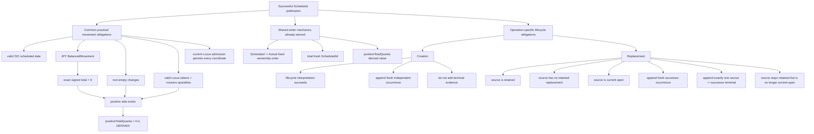

# G2-010 Scheduled Creation / Replacement obligation DAG

Status: **GENERATION-2 SIMPLIFY QUALIFIED + KEEP**

Primary instruments: **DRAKONview + obligation DAG + Lean**.

Baseline for this observation: `9a34157c065a090518a7c58b63ddd99073bd43b4`.

## Question

`ScheduledCreationPublisher` and `ScheduledReplacementPublisher` are visibly similar writers. The first G2-010 pass suggested that earlier SA-008 work had already extracted the useful common mechanics. DRAKONview then exposed one remaining repeated runtime decision that deserved a stronger question:

```text
positiveTotalQuanta movement > 0 ?
```

After #767 both writers already receive `BalancedMovement`, and both first establish that changes are nonempty and every retained quantity is nonzero. Is the positive-side check an independent admission law, or is it derivable from evidence already retained?

## Same-scale topology after G2-010

Creation:

```text
Draft : BalancedMovement
 |
 v
validate date / JPY / nonempty / token+nonzero
 |
 |  balance=0 + nonempty + nonzero
 |  => positive side exists   [Lean]
 v
Scheduled -> Actual ownership
 |
 +--> lifecycle image
 +--> Actual evidence
 `--> current Locus admission
          |
          v
all movement Loci admitted?
          |
          v
lifecycle readable?
          |
          v
fresh ScheduledId
          |
          v
append occurrence
          |
          v
publish lifecycle image
```

Replacement keeps the same shared corridor but then owns an independent transition:

```text
Draft + source ScheduledId
 |
 v
validate date / JPY / nonempty / token+nonzero
 |
 |  positive side derived, not re-checked
 v
Scheduled -> Actual ownership
 |
 +--> lifecycle image
 +--> Actual evidence
 `--> current Locus admission
          |
          v
all movement Loci admitted?
          |
          v
source retained?
          |
          v
source already replaced?
          |
          v
source current-open?
          |
          v
fresh ScheduledId
          |
          v
append successor occurrence
          |
          v
append source -> successor terminal
          |
          v
publish ONE lifecycle image
```

## Obligation DAG



The important result is that `Q` is not another runtime leaf. It is downstream of already-required evidence.

## Lean qualification

`Loam.ScheduledOccurrenceConstruction` now proves:

```text
BalancedMovement
+ movement.changes ≠ []
+ every retained quantity ≠ 0
--------------------------------
positiveTotalQuanta movement > 0
```

as `positiveTotalQuanta_pos_of_nonempty_nonzero`.

The proof uses only the retained zero-sum law and elementary integer/list arithmetic. No new domain type, admission object, or public validation layer was introduced.

The duplicated runtime branches were therefore deleted from both:

```text
ScheduledCreationPublisher.validateDraft
ScheduledReplacementPublisher.validateDraft
```

Dedicated Creation and Replacement publisher workflows both compile the proof and pass their existing publication/refusal tests without that guard.

## Why this check became redundant

PR #767 (`718d34ca12107de11845aa6882350a6874b8283c`) changed both drafts from transient Effects to canonical `BalancedMovement`. That PR intentionally preserved the old practical admission checks, including the positive-total check.

After the representation change, however, the evidence became stronger:

```text
BalancedMovement.balanced : signed total = 0
nonempty changes
all quantities nonzero
```

A nonempty list of only negative nonzero quantities cannot sum to zero. A list of only positive nonzero quantities cannot sum to zero either. Therefore any such balanced movement contains both signs, and its positive-side total is strictly positive.

G2-010 identifies the old guard as a representation-migration fossil and removes it.

## History of the shared seam

SA-008 identified Creation / Replacement fresh-occurrence construction as the strongest Scheduled subtraction candidate.

PR #730 (`0338ed7964a0acbee70eb03c1b7063b95813af72`) promoted that mechanic into `ScheduledOccurrenceConstruction`.

PR #767 then made drafts carry canonical `BalancedMovement`, retiring Effect-to-movement reconstruction and duplicated draft totals.

PR #864 (`3dff2fa0be66e8a6db4f9f2496725d8a8f1ad02c`) made fresh numbered allocation total.

G2-010 now removes one admission decision made derivable by #767. The surviving shared surface remains narrow:

```text
ScheduledActualOwnership.withOwnership
ScheduledOccurrenceConstruction.freshId
ScheduledOccurrenceConstruction.positiveTotalQuanta
```

`positiveTotalQuanta` remains useful as a derived presentation/receipt value. It is no longer an independent publication gate.

## Why the remaining validation stays local

After the simplification, Creation and Replacement still repeat four practical checks:

```text
valid ISO date
JPY measure
non-empty changes
valid token + nonzero quantity
```

They carry operation-specific refusal wording. Extracting them now would require one of:

1. an operation-name/presentation parameter in a supposedly shared mechanic;
2. a new validation-error algebra plus two adapter mappings;
3. weaker generic diagnostics.

None removes an independent semantic burden. The one branch that *was* independently removable has now been removed rather than hidden behind a helper.

Verdict: **KEEP the remaining local validation** until another independent consumer earns a typed shared error boundary.

## Other KEEP boundaries

The occurrence record literal stays local. Wrapping `{ id, scheduledOn, movement }` would hide syntax without owning a new invariant.

Lifecycle-result-to-string translation stays local. SA-008 already established that `Application.currentOpenScheduled` owns the typed semantic decision while publisher wording is adapter policy.

Replacement source admission stays explicit and ordered:

```text
source retained
-> no existing replacement
-> current-open world valid
-> source belongs to current-open set
```

Creation has no corresponding transition. Hoisting this into a generic "prepare Scheduled write" context risks changing observable refusal order.

## G2-010 verdict

**SIMPLIFY QUALIFIED + KEEP.**

SIMPLIFY:

- prove the positive-side property from retained `BalancedMovement` evidence;
- delete the redundant positive-total runtime decision from Creation;
- delete the same decision from Replacement.

KEEP:

- separate Creation and Replacement publishers;
- current narrow ownership / fresh-ID / derived-total shared seam;
- operation-local validation diagnostics;
- adapter-local lifecycle error wording;
- explicit Replacement transition refusal order.

This is a compact Generation-2 example:

```text
DRAKONview
  sees the repeated decision box
        ↓
obligation DAG
  shows it depends on retained evidence
        ↓
Lean
  proves the dependency
        ↓
production
  deletes the box instead of abstracting it
```

Reopen only if a third independent writer genuinely needs the same typed validation algebra, or if the retained Scheduled draft shape changes again.
