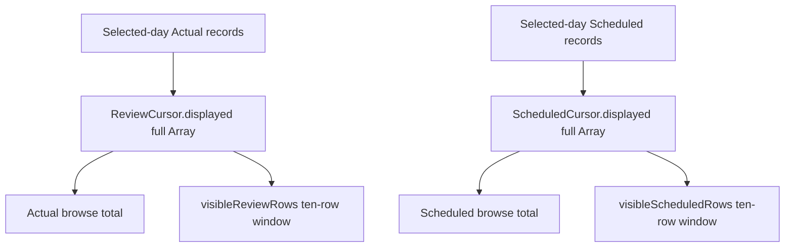

# G2-026 — TUI cursor count derivation obligation DAG

Status: **Generation-2 audit evidence — SIMPLIFY QUALIFIED**

Primary instruments: **DRAKONview + proof-obligation DAG**.

## Question

The legacy TUI browse cursors retained both the complete array for one selected day
and a separate `totalCount` value. G2-026 asks whether the count represents an
independent fact, or only an exact consequence of the retained rows.

## Root claim

For both Actual and Scheduled browse cursors, the displayed collection is the
complete selected-day collection. The ten-row viewport is derived later and does
not replace or truncate that collection. Therefore:

```text
ReviewCursor.totalCount = ReviewCursor.displayed.size
ScheduledCursor.totalCount = ScheduledCursor.displayed.size
```

No independent authority, admission result, refusal state, or pagination boundary
is represented by `totalCount`.

## Dependency DAG



The viewport nodes are deliberately downstream. `displayed` is not a viewport
cache, so the count cannot legitimately differ from its size.

## Before

```text
records
  -> displayed := records.toArray
  -> totalCount := records.length
  -> selected : Fin displayed.size

browse rendering
  -> totalCount

window rendering
  -> displayed
```

This admitted two representations of one cardinality. A manually constructed
cursor could claim a count inconsistent with the rows it retained.

## After

```text
records
  -> displayed := records.toArray
  -> selected : Fin displayed.size

cursor.totalCount
  := displayed.size
```

The presentation API remains `cursor.totalCount`; only its ownership changes from
stored state to derivation.

## Keep boundaries

G2-026 does **not** remove:

- `displayed`, because selection and scrolling consume the retained rows;
- `selected : Option (Fin displayed.size)`, because cursor position is independent
  interaction state;
- the ten-row viewport functions, because they are presentation-window behavior;
- `ActualSnapshot.undatedCount` in this change. That count is also suspicious as a
  derived summary, but deriving it requires traversing the full Actual record set.
  Its cache/performance tradeoff is a separate audit question rather than being
  collapsed into this one.

## Qualification obligations

The production change preserves:

- an Actual day with 12 records reports `12` while rendering only the local
  ten-row window;
- moving selection beyond row ten preserves the full total;
- end-of-list refusal still follows `displayed.size`;
- Scheduled browse totals remain equal to the retained full-day Scheduled array;
- no production or test constructor can supply a contradictory cursor total.

The focused TUI Actual regression pins the derived-count law. On the qualified
branch, `Compression Audit` and `Selected Lean Observations` completed
successfully, and the production TUI workflow completed all 62 verification steps
successfully. In particular, the focused `full-day Actual local window navigation`,
Scheduled browse/open-world, and HRA Scheduled steps all passed.

The dedicated G2-026 DRAKON builder is retained as reproducible audit-map source.
It is not production authority and does not participate in runtime semantics.

## Generation-2 verdict

**SIMPLIFY QUALIFIED.**

The intended semantic graph is:

```text
full selected-day rows
        |
        +--> selection / scrolling
        |
        +--> count := rows.size
```

There is one independent collection and two consequences, not two independent
representations of its cardinality.
