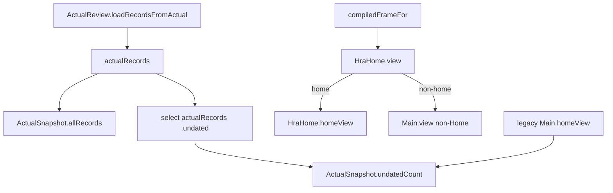

# G2-027 — TUI undated-count derivation obligation DAG

Status: **Generation-2 audit evidence — SIMPLIFY QUALIFIED**

Primary instruments: **DRAKONview + proof-obligation DAG**.

## Question

`Loam.Tui.Main.ActualSnapshot` retains both the complete transient Actual review
records and a separate `undatedCount : Nat`. G2-027 asks whether the count is an
independent read fact or only a consequence of the retained records, and whether
its eager materialization earns its cost as a cache.

## Root claim

The count has no independent authority or admission meaning:

```text
undatedCount
  = (Loam.ActualReview.select allRecords .undated).length
```

The production loader constructs it from `allRecords` immediately after loading
those records. A snapshot can nevertheless be manually constructed with a count
that disagrees with its records.

## Production reachability DAG



`HraHome.homeView` does not consume `undatedCount`. Production rendering enters
`HraHome.view`, which intercepts the Home surface before delegating non-Home
surfaces to `Main.view`. Therefore the only current read of the field is the
legacy `Main.homeView`, not the production Home route.

## Eager cache test

A retained derived value can be justified when it avoids repeated meaningful work
on a hot path. That justification does not hold here:

1. the producer computes the value on every production snapshot load;
2. `ActualReview.select` first filters and then `mergeSort`s the selected records;
3. the production Home does not read the cached value;
4. non-Home production surfaces do not need it;
5. the retained `allRecords` already contains everything required to derive it.

The current shape therefore pays eager projection cost without a production
consumer.

## Semantic ownership

The `.undated` query itself is **KEEP**. It is a real Actual Review question used
by the line CLI and means:

```text
record.isCurrent && record.date.isNone
```

G2-027 does not propose removing or weakening that query. The pressure is only on
retaining its cardinality as an independent TUI snapshot field.

## Intended simplification

The target shape is:

```text
ActualSnapshot
  today
  allRecords

legacy Main.homeView, only if retained
  -> derive undated count from allRecords on demand

production HraHome.homeView
  -> no undated-count work unless the product surface explicitly chooses to show it
```

This removes contradictory snapshot state and also stops production snapshot
construction from eagerly computing a value that production rendering does not
consume.

## Keep boundaries

G2-027 keeps:

- `ActualSnapshot.today`, because production current-horizon presentation consumes it;
- `ActualSnapshot.allRecords`, because Actual browse/detail and HRA surfaces consume
  the admitted transient records;
- `ActualReview.Query.undated`, because CLI/read-side inspection uses it;
- correction-topology and ActualValidity admission performed before records exist;
- the current HRA Home product choice not to display an undated count.

## Qualification obligations for the implementation PR

A code change should prove through compilation/tests that:

- `ActualSnapshot` no longer admits a contradictory independent count;
- the production loader no longer performs eager `.undated` selection solely for
  snapshot construction;
- legacy `Main.homeView`, while it remains, still reports the exact count derived
  from `allRecords`;
- current undated records count and superseded undated records do not;
- the line CLI `.undated` query remains unchanged;
- Production TUI and selected Lean observations remain green.

## Qualification

The code-qualified head `6991a5fa658a1dc2a8fa89025220e53b7bb66109` passed:

- Compression Audit: **SUCCESS**;
- Selected Lean Observations: **SUCCESS**;
- Purpose Catalog Boundary: **SUCCESS**;
- Production TUI: **62/62 SUCCESS**;
- focused full-day Actual local window navigation, including the G2-027 current-vs-superseded undated regression: **SUCCESS**.

## Generation-2 verdict

**SIMPLIFY QUALIFIED.**

The evidence is stronger than a normal cache-removal argument: the retained value
is an exact consequence of `allRecords`, and its only current consumer is outside
the production Home route. The next step is a narrow implementation/qualification
PR, not a broader removal of undated-record semantics.
